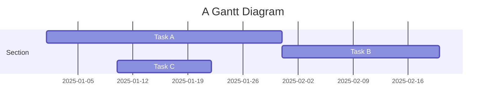
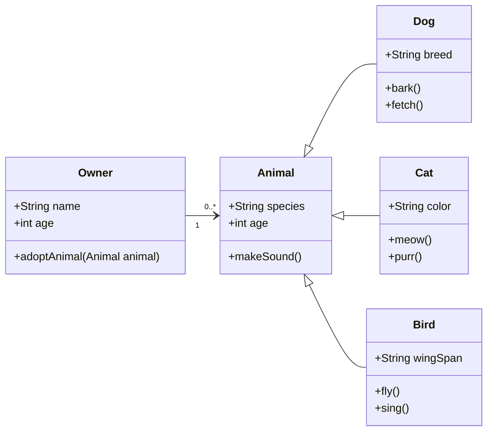

## Why Weight-only Quantization?

Recent advances in large-scale language models (LLMs) have achieved remarkable performance across a wide range of natural language understanding and generation tasks. However, deploying these models in resource‐constrained environments remains a significant challenge. In particular, Transformer‐based LLMs such as Llama-2-70B-hf require approximately 140 GB of high‐precision (FP16) parameter storage, placing them beyond the memory budgets of most edge devices and many data‐center inference clusters.  Moreover, the limited bandwidth for transferring weight data between memory and compute units during inference creates a memory-bound bottleneck, restricting overall throughput.

Weight-only quantization—where only the model parameters are stored with reduced bit-width, while activations and arithmetic operations remain in high precision—has emerged as a promising solution. By representing weights in INT4 or INT2 instead of FP16, the model size can be reduced by 4× to 8×, which also lowers the memory-traffic overhead during inference. Empirical studies show that INT4 quantization of Llama-2-70B-hf requires only 35 GB of memory (compared to 140 GB for FP16), and INT2 reduces this further to 17.5 GB. In terms of speed, quantizing a Llama-2-7B-hf model to INT4 has been shown to improve token throughput by mitigating memory bottlenecks and cache misses.

Despite these gains, existing weight-only quantization methods remain fundamentally discrete: the precision of model must be chosen from a small set of integer bit-widths (e.g., 2, 3, or 4 bits). Such discrete allocation can be overly coarse, leading to suboptimal trade-offs between model size, accuracy, and throughput. Furthermore, state-of-the-art post-training quantization (PTQ) techniques, such as GPTQ and AWQ, depend on calibration datasets and perform layer-dependent optimization: quantization errors propagate through the network, making it difficult to independently assess and adjust each layer's sensitivity. As shown in Table 1, selecting discrete bit-widths results in highly limited memory footprints and inference performance on GPUs with fixed KV-cache budgets. For example, INT4 quantization on an A100 (80 GB device memory, 30 GB KV cache) leaves only 15 GB free, whereas INT2 on an RTX 4090 (24 GB, 5 GB KV cache) leaves merely 1.5 GB—despite identical quantized model sizes—highlighting the clear opportunity to improve performance by leveraging additional memory.

Table 1. Memory and performance trade-offs for Llama-2-70B-hf under INT2/INT4 quantization on GPUs with fixed KV-cache capacities.

| GPU | KV Cache | Maximum Bits | Quantized Memory | Remaining Memory | Performance |
|:---:|:---:|:---:|:---:|:---:|:---:|
| A100 (80GB) | 30GB | INT4 | 35GB | 15GB | Little Poor |
| A6000-ADA (48GB) | 15GB | INT2 | 17.5GB | 15.5GB | Very Poor |
| RTX4090 (24GB) | 5GB | INT2 | 17.5GB | 1.5GB | Very Poor |

<p></p>

---

## Why Continous Relaxation?
This study focuses on transforming conventional discrete weight-only quantization into a continuous approach. Our motivation stems from the observation that each projection (i.e., linear layer) in an LLM exhibits varying sensitivity to quantization. Leveraging this, we propose a new approach that dynamically assigns different bit-widths to different linear layers, thereby enabling the model's average bit-width to become a continuous value rather than a fixed, discrete one.

However, this approach presents two major challenges. First, most post-training quantization (PTQ) techniques—such as GPTQ and AWQ—rely on calibration datasets and are inherently interdependent across layers. As quantization errors propagate from one layer to the next, it becomes difficult to independently assess the sensitivity of each linear layer. Second, there is no clear criterion for assigning bit-widths across layers. While assigning two distinct bit-widths (e.g., 2 and 3 bits) can be managed with a well-defined target average, assigning three or more (e.g., 2, 3, and 4 bits) demands a more fine-grained strategy. These limitations necessitate extensive search or hand-crafted tuning, even when bit allocation can be performed in a relatively short time.

To overcome these challenges, we propose a new method that enables optimal bit allocation based on a principled criterion within a single forward pass. First, we define a quantization proxy sensitivity metric that eliminates the need to fully quantize the model at each search iteration, while still effectively representing the layer-wise quantization error. Second, we utilize the proxy sensitivities for 2, 3, and 4-bit quantization to construct a bit-performance Pareto frontier, from which bit combinations suitable for various deployment constraints can be derived. Building on these ideas, we introduce CWQ: Continuous Relaxation for Weight-only Quantization, a novel and computationally efficient method that bridges the gap between discrete and continuous weight-only quantization for large-scale language models.

<div class="row mt-3">
    <div class="col-sm mt-3 mt-md-0">
        
    </div>
</div>
<div class="caption">
    CWQ can fit any device, any constraint.
</div>

---

## Data-Dependent and Data-Independent Method
Quantization algorithms for large language models can be classified into two main categories, each offering different trade-offs in terms of accuracy, computational overhead, and flexibility:

Methods like GPTQ and AWQ establish per-layer quantization by analyzing both weights and activations using a calibration dataset. While this activation-aware approach achieves state-of-the-art model quality, implementing a new bit-width configuration quantized model necessitates a complete end-to-end quantization process—resulting in significant format-conversion costs, multiple forward passes, and inter-layer dependencies that render comprehensive search infeasible.

Techniques such as Half-Quadratic Quantization (HQQ) perform weight quantization based exclusively on their weight distribution, without utilizing activations or calibration data. Through decoupling the quantization of each layer, these methods remove per-layer overhead and enable immediate "assembly" of mixed-precision models, though with a slight reduction in accuracy compared to data-dependent methods.

---

## Quantization Sensitivity

A core observation in weight-only quantization is that different linear layers in a Transformer exhibit markedly different tolerance to low-bit representations. To systematically quantify this quantization sensitivity, we adopt the following:

We begin with a fully 4-bit quantized model, using HQQ for weight-only quantization as our data-independent proxy. For each linear layer L_i in turn, we temporarily reduce its precision to 2 bits while keeping all other layers at 4 bits. This “one-at-a-time” drop tests the isolated impact of each layer’s quantization on overall model quality. Rather than performing a full, data-dependent quantization pass for each configuration, we assemble the mixed-precision model by selecting from pre-quantized 2-bit and 4-bit replicas of each layer—our quantization proxy—in O(1) time per layer. This avoids hours of per-configuration format conversion and calibration. Finally, We measure degradation by the Jensen–Shannon divergence between the quantized model’s output distribution and that of the original FP16 model, evaluated on a small calibration set. Specifically, 
$$
for \; logits \; z(quantized)\;and \; \hat z (original),
$$
$$
\mathrm{JSD}(z,\hat z)
= \tfrac12\bigl[D_{\mathrm{KL}}(s\Vert m) + D_{\mathrm{KL}}(\hat s\Vert m)\bigr],
\quad
s = \mathrm{softmax}(z),\;\hat s = \mathrm{softmax}(\hat z),\;m=\tfrac12(s+\hat s).
$$

<div class="row mt-3">
    <div class="col-sm mt-3 mt-md-0">
        
    </div>
</div>
<div class="caption">
    CWQ can fit any device, any constraint.
</div>
Figure 2: Perplexity degradation on WikiText-2 when each linear layer of Llama-2-7B is individually quantized to 2 bits (others at 4 bits).  Sensitivity varies widely, motivating selective high-precision allocation.  

</div>


As Figure 2 demonstrates, certain layers (e.g., Value and output projections in self-attention) incur sharp perplexity spikes under 2-bit, whereas others (e.g., some feed-forward gates or Query projections) show minimal impact.  This non-uniform profile validates our strategy of space reduction—excluding high-sensitivity layers from low-bit assignment—and underpins both our discrete mixed-precision search and continuous-relaxation allocation schemes.
---


## Citations

Citations are then used in the article body with the `<d-cite>` tag.
The key attribute is a reference to the id provided in the bibliography.
The key attribute can take multiple ids, separated by commas.

The citation is presented inline like this: <d-cite key="gregor2015draw"></d-cite> (a number that displays more information on hover).
If you have an appendix, a bibliography is automatically created and populated in it.

Distill chose a numerical inline citation style to improve readability of citation dense articles and because many of the benefits of longer citations are obviated by displaying more information on hover.
However, we consider it good style to mention author last names if you discuss something at length and it fits into the flow well — the authors are human and it's nice for them to have the community associate them with their work.

---

## Footnotes

Just wrap the text you would like to show up in a footnote in a `<d-footnote>` tag.
The number of the footnote will be automatically generated.<d-footnote>This will become a hoverable footnote.</d-footnote>

---

## Code Blocks

Syntax highlighting is provided within `<d-code>` tags.
An example of inline code snippets: `<d-code language="html">let x = 10;</d-code>`.
For larger blocks of code, add a `block` attribute:

<d-code block language="javascript">
  var x = 25;
  function(x) {
    return x * x;
  }
</d-code>

**Note:** `<d-code>` blocks do not look good in the dark mode. You can instead use the standard Jekyll syntax highlight with the `highlight` liquid tag.


var x = 25;
function(x) {
return x \* x;
}


You can also write standard Markdown code blocks in triple ticks with a language tag, for instance:

```python
def foo(x):
  return x
```

---

## Interactive Plots

You can add interative plots using plotly + iframes :framed_picture:

<div class="l-page">
  <iframe src="{{ '/assets/plotly/demo.html' | relative_url }}" frameborder='0' scrolling='no' height="500px" width="100%" style="border: 1px dashed grey;"></iframe>
</div>

The plot must be generated separately and saved into an HTML file.
To generate the plot that you see above, you can use the following code snippet:


import pandas as pd
import plotly.express as px
df = pd.read_csv(
'https://raw.githubusercontent.com/plotly/datasets/master/earthquakes-23k.csv'
)
fig = px.density_mapbox(
df,
lat='Latitude',
lon='Longitude',
z='Magnitude',
radius=10,
center=dict(lat=0, lon=180),
zoom=0,
mapbox_style="stamen-terrain",
)
fig.show()
fig.write_html('assets/plotly/demo.html')


---

## Details boxes

Details boxes are collapsible boxes which hide additional information from the user. They can be added with the `details` liquid tag:


Additional details, where math $$ 2x - 1 $$ and `code` is rendered correctly.


---

## Mermaid

This theme supports creating diagrams directly in markdown using [Mermaid](https://mermaid.js.org/). Mermaid enables users to render flowcharts, sequence diagrams, class diagrams, Gantt charts, and more. Simply embed the diagram syntax within a mermaid code block.

To create a Gantt chart, you can use the following syntax:

````markdown

````

And here’s how it will be rendered:


Similarly, you can also use it to create beautiful class diagrams:

````

````

It will be presented as:


With Mermaid, you can easily add clear and dynamic diagrams to enhance your blog content.

---

## Diff2Html

This theme also supports integrating [Diff2Html](https://github.com/rtfpessoa/diff2html), a tool that beautifully renders code differences (diffs) directly in markdown. Diff2Html is ideal for showcasing code changes, allowing you to clearly present additions, deletions, and modifications. It’s perfect for code reviews, documentation, and tutorials where step-by-step code changes need to be highlighted—you can even introduce changes across multiple files at once.

````markdown
```diff2html
diff --git a/utils/mathUtils.js b/utils/mathUtils.js
index 3b5f3d1..c7f9b2e 100644
--- a/utils/mathUtils.js
+++ b/utils/mathUtils.js
@@ -1,8 +1,12 @@
-// Basic math utilities
+// Extended math utilities with additional functions

-export function calculateArea(radius) {
-    const PI = 3.14159;
+export function calculateCircleMetrics(radius) {
+    const PI = Math.PI;
     const area = PI * radius ** 2;
+    const circumference = 2 * PI * radius;
+
+    if (!isValidRadius(radius)) throw new Error("Invalid radius");
+
     return { area, circumference };
 }

-export function validateRadius(radius) {
+export function isValidRadius(radius) {
     return typeof radius === 'number' && radius > 0;
 }

diff --git a/main.js b/main.js
index 5f6a9c3..b7d4e8f 100644
--- a/main.js
+++ b/main.js
@@ -2,9 +2,12 @@
 import { calculateCircleMetrics } from './utils/mathUtils';

-function displayCircleMetrics(radius) {
-    const { area } = calculateCircleMetrics(radius);
+function displayCircleMetrics(radius) {
+    const { area, circumference } = calculateCircleMetrics(radius);
     console.log(`Area: ${area}`);
+    console.log(`Circumference: ${circumference}`);
 }

-displayCircleMetrics(5);
+try {
+    displayCircleMetrics(5);
+} catch (error) {
+    console.error("Error:", error.message);
+}
```
````

Here’s how it will look when rendered with Diff2Html:

```diff2html
diff --git a/utils/mathUtils.js b/utils/mathUtils.js
index 3b5f3d1..c7f9b2e 100644
--- a/utils/mathUtils.js
+++ b/utils/mathUtils.js
@@ -1,8 +1,12 @@
-// Basic math utilities
+// Extended math utilities with additional functions

-export function calculateArea(radius) {
-    const PI = 3.14159;
+export function calculateCircleMetrics(radius) {
+    const PI = Math.PI;
     const area = PI * radius ** 2;
+    const circumference = 2 * PI * radius;
+
+    if (!isValidRadius(radius)) throw new Error("Invalid radius");
+
     return { area, circumference };
 }

-export function validateRadius(radius) {
+export function isValidRadius(radius) {
     return typeof radius === 'number' && radius > 0;
 }

diff --git a/main.js b/main.js
index 5f6a9c3..b7d4e8f 100644
--- a/main.js
+++ b/main.js
@@ -2,9 +2,12 @@
 import { calculateCircleMetrics } from './utils/mathUtils';

-function displayCircleMetrics(radius) {
-    const { area } = calculateCircleMetrics(radius);
+function displayCircleMetrics(radius) {
+    const { area, circumference } = calculateCircleMetrics(radius);
     console.log(`Area: ${area}`);
+    console.log(`Circumference: ${circumference}`);
 }

-displayCircleMetrics(5);
+try {
+    displayCircleMetrics(5);
+} catch (error) {
+    console.error("Error:", error.message);
+}
```

---

## Leaflet

[Leaflet](https://leafletjs.com/) is created by Ukrainian software engineer [Volodymyr Agafonkin](https://agafonkin.com/), allowing interactive maps to be embedded in webpages. With support for [GeoJSON data](https://geojson.org/), Leaflet allows you to highlight specific regions, making it easy to visualize geographical information in detail.

You can use the following code to load map information on [OpenStreetMap](https://www.openstreetmap.org/):

````markdown
```geojson
{
  "type": "FeatureCollection",
  "features": [
    {
      "type": "Feature",
      "properties": {
        "name": "Crimea",
        "popupContent": "Occupied Crimea"
      },
      "geometry": {
        "type": "Polygon",
        "coordinates": [
          [
            [
              33.9,
              45.3
            ],
            [
              36.5,
              45.3
            ],
            [
              36.5,
              44.4
            ],
            [
              33.9,
              44.4
            ],
            [
              33.9,
              45.3
            ]
          ]
        ]
      }
    },
    {
      "type": "Feature",
      "properties": {
        "name": "Donetsk",
        "popupContent": "Occupied Donetsk"
      },
      "geometry": {
        "type": "Polygon",
        "coordinates": [
          [
            [
              37.5,
              48.5
            ],
            [
              39.5,
              48.5
            ],
            [
              39.5,
              47.5
            ],
            [
              37.5,
              47.5
            ],
            [
              37.5,
              48.5
            ]
          ]
        ]
      }
    },
    {
      "type": "Feature",
      "properties": {
        "name": "Luhansk",
        "popupContent": "Occupied Luhansk"
      },
      "geometry": {
        "type": "Polygon",
        "coordinates": [
          [
            [
              38.5,
              49.5
            ],
            [
              40.5,
              49.5
            ],
            [
              40.5,
              48.5
            ],
            [
              38.5,
              48.5
            ],
            [
              38.5,
              49.5
            ]
          ]
        ]
      }
    },
    {
      "type": "Feature",
      "properties": {
        "name": "Kherson",
        "popupContent": "Occupied Kherson"
      },
      "geometry": {
        "type": "Polygon",
        "coordinates": [
          [
            [
              32.3,
              47.3
            ],
            [
              34.3,
              47.3
            ],
            [
              34.3,
              46.3
            ],
            [
              32.3,
              46.3
            ],
            [
              32.3,
              47.3
            ]
          ]
        ]
      }
    },
    {
      "type": "Feature",
      "properties": {
        "name": "Zaporizhzhia",
        "popupContent": "Occupied Zaporizhzhia"
      },
      "geometry": {
        "type": "Polygon",
        "coordinates": [
          [
            [
              34.3,
              48
            ],
            [
              36.3,
              48
            ],
            [
              36.3,
              47
            ],
            [
              34.3,
              47
            ],
            [
              34.3,
              48
            ]
          ]
        ]
      }
    }
  ]
}
```
````

The rendered map below highlights the regions of Ukraine that have been illegally occupied by Russia over the years, including Crimea and the four eastern regions:

```geojson
{
  "type": "FeatureCollection",
  "features": [
    {
      "type": "Feature",
      "properties": {
        "name": "Crimea",
        "popupContent": "Occupied Crimea"
      },
      "geometry": {
        "type": "Polygon",
        "coordinates": [
          [
            [
              33.9,
              45.3
            ],
            [
              36.5,
              45.3
            ],
            [
              36.5,
              44.4
            ],
            [
              33.9,
              44.4
            ],
            [
              33.9,
              45.3
            ]
          ]
        ]
      }
    },
    {
      "type": "Feature",
      "properties": {
        "name": "Donetsk",
        "popupContent": "Occupied Donetsk"
      },
      "geometry": {
        "type": "Polygon",
        "coordinates": [
          [
            [
              37.5,
              48.5
            ],
            [
              39.5,
              48.5
            ],
            [
              39.5,
              47.5
            ],
            [
              37.5,
              47.5
            ],
            [
              37.5,
              48.5
            ]
          ]
        ]
      }
    },
    {
      "type": "Feature",
      "properties": {
        "name": "Luhansk",
        "popupContent": "Occupied Luhansk"
      },
      "geometry": {
        "type": "Polygon",
        "coordinates": [
          [
            [
              38.5,
              49.5
            ],
            [
              40.5,
              49.5
            ],
            [
              40.5,
              48.5
            ],
            [
              38.5,
              48.5
            ],
            [
              38.5,
              49.5
            ]
          ]
        ]
      }
    },
    {
      "type": "Feature",
      "properties": {
        "name": "Kherson",
        "popupContent": "Occupied Kherson"
      },
      "geometry": {
        "type": "Polygon",
        "coordinates": [
          [
            [
              32.3,
              47.3
            ],
            [
              34.3,
              47.3
            ],
            [
              34.3,
              46.3
            ],
            [
              32.3,
              46.3
            ],
            [
              32.3,
              47.3
            ]
          ]
        ]
      }
    },
    {
      "type": "Feature",
      "properties": {
        "name": "Zaporizhzhia",
        "popupContent": "Occupied Zaporizhzhia"
      },
      "geometry": {
        "type": "Polygon",
        "coordinates": [
          [
            [
              34.3,
              48
            ],
            [
              36.3,
              48
            ],
            [
              36.3,
              47
            ],
            [
              34.3,
              47
            ],
            [
              34.3,
              48
            ]
          ]
        ]
      }
    }
  ]
}
```

---

## Chartjs, Echarts and Vega-Lite

[Chart.js](https://www.chartjs.org/) is a versatile JavaScript library for creating responsive and interactive charts. Supporting multiple chart types like bar, line, pie, and radar, it’s an ideal tool for visualizing data directly in webpages.

Here’s an example of a JSON-style configuration that creates a bar chart in Chart.js:

````
```chartjs
{
  "type": "bar",
  "data": {
    "labels": ["2017", "2018", "2019", "2020", "2021"],
    "datasets": [
      {
        "label": "Population (millions)",
        "data": [12, 15, 13, 14, 16],
        "backgroundColor": "rgba(54, 162, 235, 0.6)",
        "borderColor": "rgba(54, 162, 235, 1)",
        "borderWidth": 1
      }
    ]
  },
  "options": {
    "scales": {
      "y": {
        "beginAtZero": true
      }
    }
  }
}
```
````

The rendered bar chart illustrates population data from 2017 to 2021:

```chartjs
{
  "type": "bar",
  "data": {
    "labels": ["2017", "2018", "2019", "2020", "2021"],
    "datasets": [
      {
        "label": "Population (millions)",
        "data": [12, 15, 13, 14, 16],
        "backgroundColor": "rgba(54, 162, 235, 0.6)",
        "borderColor": "rgba(54, 162, 235, 1)",
        "borderWidth": 1
      }
    ]
  },
  "options": {
    "scales": {
      "y": {
        "beginAtZero": true
      }
    }
  }
}
```

---

[ECharts](https://echarts.apache.org/) is a powerful visualization library from [Apache](https://www.apache.org/) that supports a wide range of interactive charts, including more advanced types such as scatter plots, heatmaps, and geographic maps.

The following JSON configuration creates a visually enhanced line chart that displays monthly sales data for two products.

````
```echarts
{
  "title": {
    "text": "Monthly Sales Comparison",
    "left": "center"
  },
  "tooltip": {
    "trigger": "axis",
    "backgroundColor": "rgba(50, 50, 50, 0.7)",
    "borderColor": "#777",
    "borderWidth": 1,
    "textStyle": {
      "color": "#fff"
    }
  },
  "legend": {
    "data": ["Product A", "Product B"],
    "top": "10%"
  },
  "xAxis": {
    "type": "category",
    "data": ["Jan", "Feb", "Mar", "Apr", "May", "Jun", "Jul", "Aug", "Sep", "Oct", "Nov", "Dec"],
    "axisLine": {
      "lineStyle": {
        "color": "#888"
      }
    }
  },
  "yAxis": {
    "type": "value",
    "axisLine": {
      "lineStyle": {
        "color": "#888"
      }
    },
    "splitLine": {
      "lineStyle": {
        "type": "dashed"
      }
    }
  },
  "series": [
    {
      "name": "Product A",
      "type": "line",
      "smooth": true,
      "data": [820, 932, 901, 934, 1290, 1330, 1320, 1400, 1450, 1500, 1600, 1650],
      "itemStyle": {
        "color": "#5470C6"
      },
      "lineStyle": {
        "width": 3
      },
      "areaStyle": {
        "color": {
          "type": "linear",
          "x": 0,
          "y": 0,
          "x2": 0,
          "y2": 1,
          "colorStops": [
            { "offset": 0, "color": "rgba(84, 112, 198, 0.5)" },
            { "offset": 1, "color": "rgba(84, 112, 198, 0)" }
          ]
        }
      },
      "emphasis": {
        "focus": "series"
      }
    },
    {
      "name": "Product B",
      "type": "line",
      "smooth": true,
      "data": [620, 732, 701, 734, 1090, 1130, 1120, 1200, 1250, 1300, 1400, 1450],
      "itemStyle": {
        "color": "#91CC75"
      },
      "lineStyle": {
        "width": 3
      },
      "areaStyle": {
        "color": {
          "type": "linear",
          "x": 0,
          "y": 0,
          "x2": 0,
          "y2": 1,
          "colorStops": [
            { "offset": 0, "color": "rgba(145, 204, 117, 0.5)" },
            { "offset": 1, "color": "rgba(145, 204, 117, 0)" }
          ]
        }
      },
      "emphasis": {
        "focus": "series"
      }
    }
  ]
}
```
````

The rendered output is shown below, and you can also interact with it using your mouse:

```echarts
{
  "title": {
    "text": "Monthly Sales Comparison",
    "left": "center"
  },
  "tooltip": {
    "trigger": "axis",
    "backgroundColor": "rgba(50, 50, 50, 0.7)",
    "borderColor": "#777",
    "borderWidth": 1,
    "textStyle": {
      "color": "#fff"
    }
  },
  "legend": {
    "data": ["Product A", "Product B"],
    "top": "10%"
  },
  "xAxis": {
    "type": "category",
    "data": ["Jan", "Feb", "Mar", "Apr", "May", "Jun", "Jul", "Aug", "Sep", "Oct", "Nov", "Dec"],
    "axisLine": {
      "lineStyle": {
        "color": "#888"
      }
    }
  },
  "yAxis": {
    "type": "value",
    "axisLine": {
      "lineStyle": {
        "color": "#888"
      }
    },
    "splitLine": {
      "lineStyle": {
        "type": "dashed"
      }
    }
  },
  "series": [
    {
      "name": "Product A",
      "type": "line",
      "smooth": true,
      "data": [820, 932, 901, 934, 1290, 1330, 1320, 1400, 1450, 1500, 1600, 1650],
      "itemStyle": {
        "color": "#5470C6"
      },
      "lineStyle": {
        "width": 3
      },
      "areaStyle": {
        "color": {
          "type": "linear",
          "x": 0,
          "y": 0,
          "x2": 0,
          "y2": 1,
          "colorStops": [
            { "offset": 0, "color": "rgba(84, 112, 198, 0.5)" },
            { "offset": 1, "color": "rgba(84, 112, 198, 0)" }
          ]
        }
      },
      "emphasis": {
        "focus": "series"
      }
    },
    {
      "name": "Product B",
      "type": "line",
      "smooth": true,
      "data": [620, 732, 701, 734, 1090, 1130, 1120, 1200, 1250, 1300, 1400, 1450],
      "itemStyle": {
        "color": "#91CC75"
      },
      "lineStyle": {
        "width": 3
      },
      "areaStyle": {
        "color": {
          "type": "linear",
          "x": 0,
          "y": 0,
          "x2": 0,
          "y2": 1,
          "colorStops": [
            { "offset": 0, "color": "rgba(145, 204, 117, 0.5)" },
            { "offset": 1, "color": "rgba(145, 204, 117, 0)" }
          ]
        }
      },
      "emphasis": {
        "focus": "series"
      }
    }
  ]
}
```

---

[Vega-Lite](https://vega.github.io/vega-lite/) is a declarative visualization grammar that allows users to create, share, and customize a wide range of interactive data visualizations. The following JSON configuration generates a straightforward bar chart:

````
```vega_lite
{
  "$schema": "https://vega.github.io/schema/vega/v5.json",
  "width": 400,
  "height": 200,
  "padding": 5,

  "data": [
    {
      "name": "table",
      "values": [
        {"category": "A", "value": 28},
        {"category": "B", "value": 55},
        {"category": "C", "value": 43},
        {"category": "D", "value": 91},
        {"category": "E", "value": 81},
        {"category": "F", "value": 53},
        {"category": "G", "value": 19},
        {"category": "H", "value": 87}
      ]
    }
  ],

  "scales": [
    {
      "name": "xscale",
      "type": "band",
      "domain": {"data": "table", "field": "category"},
      "range": "width",
      "padding": 0.1
    },
    {
      "name": "yscale",
      "type": "linear",
      "domain": {"data": "table", "field": "value"},
      "nice": true,
      "range": "height"
    }
  ],

  "axes": [
    {"orient": "bottom", "scale": "xscale"},
    {"orient": "left", "scale": "yscale"}
  ],

  "marks": [
    {
      "type": "rect",
      "from": {"data": "table"},
      "encode": {
        "enter": {
          "x": {"scale": "xscale", "field": "category"},
          "width": {"scale": "xscale", "band": 0.8},
          "y": {"scale": "yscale", "field": "value"},
          "y2": {"scale": "yscale", "value": 0},
          "fill": {"value": "steelblue"}
        },
        "update": {
          "fillOpacity": {"value": 1}
        },
        "hover": {
          "fill": {"value": "orange"}
        }
      }
    }
  ]
}
```
````

The rendered output shows a clean and simple bar chart with a hover effect：

```vega_lite
{
  "$schema": "https://vega.github.io/schema/vega/v5.json",
  "width": 400,
  "height": 200,
  "padding": 5,

  "data": [
    {
      "name": "table",
      "values": [
        {"category": "A", "value": 28},
        {"category": "B", "value": 55},
        {"category": "C", "value": 43},
        {"category": "D", "value": 91},
        {"category": "E", "value": 81},
        {"category": "F", "value": 53},
        {"category": "G", "value": 19},
        {"category": "H", "value": 87}
      ]
    }
  ],

  "scales": [
    {
      "name": "xscale",
      "type": "band",
      "domain": {"data": "table", "field": "category"},
      "range": "width",
      "padding": 0.1
    },
    {
      "name": "yscale",
      "type": "linear",
      "domain": {"data": "table", "field": "value"},
      "nice": true,
      "range": "height"
    }
  ],

  "axes": [
    {"orient": "bottom", "scale": "xscale"},
    {"orient": "left", "scale": "yscale"}
  ],

  "marks": [
    {
      "type": "rect",
      "from": {"data": "table"},
      "encode": {
        "enter": {
          "x": {"scale": "xscale", "field": "category"},
          "width": {"scale": "xscale", "band": 0.8},
          "y": {"scale": "yscale", "field": "value"},
          "y2": {"scale": "yscale", "value": 0},
          "fill": {"value": "steelblue"}
        },
        "update": {
          "fillOpacity": {"value": 1}
        },
        "hover": {
          "fill": {"value": "orange"}
        }
      }
    }
  ]
}
```

---

## TikZ

[TikZ](https://tikz.net/) is a powerful LaTeX-based drawing tool powered by [TikZJax](https://tikzjax.com/). You can easily port TikZ drawings from papers, posters, and notes. For example, we can use the following code to illustrate Euler’s formula $ e^{i \theta} = \cos \theta + i \sin \theta $:

```markdown
<script type="text/tikz">
\begin{tikzpicture}
    \filldraw[fill=cyan!10, draw=blue, thick] (0,0) circle (2cm);

    \draw[->, thick] (-2.5,0) -- (2.5,0) node[right] {Re};
    \draw[->, thick] (0,-2.5) -- (0,2.5) node[above] {Im};

    \draw[->, thick, color=purple] (0,0) -- (1.5,1.5);
    \node[color=purple] at (1.1, 1.7) {$e^{i\theta}$};

    \draw[thick] (0.7,0) arc (0:45:0.7);
    \node at (0.9, 0.3) {$\theta$};

    \draw[dashed, color=gray] (1.5,1.5) -- (1.5,0) node[below, black] {$\cos \theta$};
    \draw[dashed, color=gray] (1.5,1.5) -- (0,1.5) node[left, black] {$\sin \theta$};
    \node at (2.2, 0) [below] {1}; 
    \node at (0, 2.2) [left] {$i$}; 
    \node at (1.5,1.5) [above right, color=blue] {$(\cos \theta \, \sin \theta)$}; 
\end{tikzpicture}
</script>
```

The rendered output is shown below, displayed as a vector graphic：

<script type="text/tikz">
\begin{tikzpicture}
    \filldraw[fill=cyan!10, draw=blue, thick] (0,0) circle (2cm);

    \draw[->, thick] (-2.5,0) -- (2.5,0) node[right] {Re};
    \draw[->, thick] (0,-2.5) -- (0,2.5) node[above] {Im};

    \draw[->, thick, color=purple] (0,0) -- (1.5,1.5);
    \node[color=purple] at (1.1, 1.7) {$e^{i\theta}$};

    \draw[thick] (0.7,0) arc (0:45:0.7);
    \node at (0.9, 0.3) {$\theta$};

    \draw[dashed, color=gray] (1.5,1.5) -- (1.5,0) node[below, black] {$\cos \theta$};
    \draw[dashed, color=gray] (1.5,1.5) -- (0,1.5) node[left, black] {$\sin \theta$};
    \node at (2.2, 0) [below] {1}; 
    \node at (0, 2.2) [left] {$i$}; 
    \node at (1.5,1.5) [above right, color=blue] {$(\cos \theta \, \sin \theta)$}; 
\end{tikzpicture}
</script>

---

## Typograms

[Typograms](https://google.github.io/typograms/) are a way of combining text and graphics to convey information in a clear and visually engaging manner. Typograms are particularly effective for illustrating simple diagrams, charts, and concept visuals where text and graphics are closely integrated. The following example demonstrates a simple Typogram:

````
```typograms
             ___________________
            /                  /|
           /__________________/ |
          |                  |  |
          |     Distill      |  |
          |                  |  |
          |                  | /
          |__________________|/
```
````

The rendered output is shown below：

```typograms
             ___________________
            /                  /|
           /__________________/ |
          |                  |  |
          |     Distill      |  |
          |                  |  |
          |                  | /
          |__________________|/
```

---

## Layouts

The main text column is referred to as the body.
It is the assumed layout of any direct descendants of the `d-article` element.

<div class="fake-img l-body">
  <p>.l-body</p>
</div>

For images you want to display a little larger, try `.l-page`:

<div class="fake-img l-page">
  <p>.l-page</p>
</div>

All of these have an outset variant if you want to poke out from the body text a little bit.
For instance:

<div class="fake-img l-body-outset">
  <p>.l-body-outset</p>
</div>

<div class="fake-img l-page-outset">
  <p>.l-page-outset</p>
</div>

Occasionally you’ll want to use the full browser width.
For this, use `.l-screen`.
You can also inset the element a little from the edge of the browser by using the inset variant.

<div class="fake-img l-screen">
  <p>.l-screen</p>
</div>
<div class="fake-img l-screen-inset">
  <p>.l-screen-inset</p>
</div>

The final layout is for marginalia, asides, and footnotes.
It does not interrupt the normal flow of `.l-body` sized text except on mobile screen sizes.

<div class="fake-img l-gutter">
  <p>.l-gutter</p>
</div>

---

## Other Typography?

Emphasis, aka italics, with _asterisks_ (`*asterisks*`) or _underscores_ (`_underscores_`).

Strong emphasis, aka bold, with **asterisks** or **underscores**.

Combined emphasis with **asterisks and _underscores_**.

Strikethrough uses two tildes. ~~Scratch this.~~

1. First ordered list item
2. Another item
   ⋅⋅\* Unordered sub-list.
3. Actual numbers don't matter, just that it's a number
   ⋅⋅1. Ordered sub-list
4. And another item.

⋅⋅⋅You can have properly indented paragraphs within list items. Notice the blank line above, and the leading spaces (at least one, but we'll use three here to also align the raw Markdown).

⋅⋅⋅To have a line break without a paragraph, you will need to use two trailing spaces.⋅⋅
⋅⋅⋅Note that this line is separate, but within the same paragraph.⋅⋅
⋅⋅⋅(This is contrary to the typical GFM line break behaviour, where trailing spaces are not required.)

- Unordered list can use asterisks

* Or minuses

- Or pluses

[I'm an inline-style link](https://www.google.com)

[I'm an inline-style link with title](https://www.google.com "Google's Homepage")

[I'm a reference-style link][Arbitrary case-insensitive reference text]

[You can use numbers for reference-style link definitions][1]

Or leave it empty and use the [link text itself].

URLs and URLs in angle brackets will automatically get turned into links.
http://www.example.com or <http://www.example.com> and sometimes
example.com (but not on Github, for example).

Some text to show that the reference links can follow later.

[arbitrary case-insensitive reference text]: https://www.mozilla.org
[1]: http://slashdot.org
[link text itself]: http://www.reddit.com

Here's our logo (hover to see the title text):

Inline-style:


Reference-style:
![alt text][logo]

[logo]: https://github.com/adam-p/markdown-here/raw/master/src/common/images/icon48.png "Logo Title Text 2"

Inline `code` has `back-ticks around` it.

```javascript
var s = "JavaScript syntax highlighting";
alert(s);
```

```python
s = "Python syntax highlighting"
print s
```

```
No language indicated, so no syntax highlighting.
But let's throw in a <b>tag</b>.
```

Colons can be used to align columns.

| Tables        |      Are      |  Cool |
| ------------- | :-----------: | ----: |
| col 3 is      | right-aligned | $1600 |
| col 2 is      |   centered    |   $12 |
| zebra stripes |   are neat    |    $1 |

There must be at least 3 dashes separating each header cell.
The outer pipes (|) are optional, and you don't need to make the
raw Markdown line up prettily. You can also use inline Markdown.

| Markdown | Less      | Pretty     |
| -------- | --------- | ---------- |
| _Still_  | `renders` | **nicely** |
| 1        | 2         | 3          |

> Blockquotes are very handy in email to emulate reply text.
> This line is part of the same quote.

Quote break.

> This is a very long line that will still be quoted properly when it wraps. Oh boy let's keep writing to make sure this is long enough to actually wrap for everyone. Oh, you can _put_ **Markdown** into a blockquote.

Here's a line for us to start with.

This line is separated from the one above by two newlines, so it will be a _separate paragraph_.

This line is also a separate paragraph, but...
This line is only separated by a single newline, so it's a separate line in the _same paragraph_.
